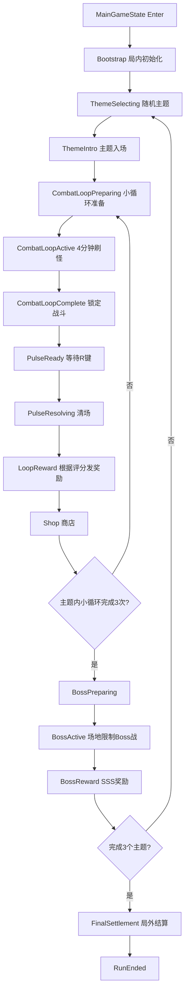

# NeonPulse 局内主循环系统设计文档

> 建议放置路径：`Docs/NeonPulse_InRunSystemDesign.md`  
> 面向对象：人类开发者 + 后续编码 Agent  
> 版本：V0.1  
> 日期：2026-05-09

---

## 0. Agent 先读说明

后续 Agent 开始实现局内系统前，应先阅读：

1. `ProjectMap.md`
2. 本文档 `NeonPulse_InRunSystemDesign.md`

实现原则：

- 不要复活旧的局内 runtime 主流程。
- 保留并继续使用当前项目已经稳定下来的局外/装配基础：
  - `GameMgr`
  - `DataManager`
  - `LoadoutManager`
  - `GameConfigDatabase`
  - `MetaProgressData`
  - `RunLoadoutData`
  - `AssembleUI`
  - 当前 `MainGameState` 中已经存在的玩家生成入口
- 局内系统应作为一套新的、独立的 runtime 层接入，而不是继续扩展旧的 `WaveManager / UpgradeManager / OLD_ModuleConfig / LevelUpUI` 路线。
- 新局内系统的配置优先使用 ScriptableObject，运行期状态使用可序列化 runtime data，避免把玩法规则硬编码进 MonoBehaviour。
- 模块、配件、核心、框架等身份一律优先使用 `moduleId / coreId / pluginId / frameId`，不要重新引入旧的 `StatType` 或以 `ModuleType` 作为唯一身份。
- 每完成一次代码变更，应运行：

```bash
dotnet build Assembly-CSharp.csproj --no-restore
```

---

## 1. 当前设计目标

本阶段目标不是一次性做完整游戏，而是先做出一个可以跑通的“局内版本”。

这个版本需要验证：

- 玩家从局外装配进入战场后，可以进行完整的一局。
- 一局由 3 个大循环组成。
- 每个大循环随机抽取一个主题。
- 每个主题包含：
  - 背景/视觉主题
  - 小怪池
  - 本主题 Boss
  - 奖励池/商店池
- 每个主题内有 3 个小循环。
- 每个小循环持续 4 分钟。
- 小循环期间不断刷怪，刷怪速度和怪物强度随时间提升。
- 主题怪物种类不会在第一个小循环全部刷出，而是在三个小循环中逐渐展开，并保证主题内的主要怪物都能出现。
- 玩家击杀敌人获得积分。
- 连杀提供倍率奖励。
- 玩家受击会打断连杀倍率。
- 每个小循环结束时，玩家可以按 R 发射一次脉冲。
- 脉冲清除场上所有普通敌人，但被清除的敌人不给积分。
- 小循环根据积分表现评出 `F ~ SSS`。
- 根据评分给予奖励，例如模块、配件、核心、道具。
- 之后进入商店。
- 商店允许玩家使用刚才获得的积分购买模块、配件、框架、道具、仓库扩建、地图扩建等。
- 三个小循环结束后进入 Boss 战。
- Boss 战会限制战斗场地。
- 击败 Boss 后给予一次 SSS 级别奖励，然后进入下一个主题。
- 完成 3 个主题后，本局结束，结算局外奖励，包括局外货币、模块解锁、框架解锁、核心解锁等。

---

## 2. 核心术语

### 2.1 Run / 一局

一次从玩家进入战场开始，到完成 3 个主题并结算局外奖励为止的完整流程。

结构：

```text
Run
├── ThemeCycle 1
│   ├── CombatLoop 1
│   ├── Shop 1
│   ├── CombatLoop 2
│   ├── Shop 2
│   ├── CombatLoop 3
│   ├── Shop 3
│   └── BossEncounter
├── ThemeCycle 2
│   └── 同上
├── ThemeCycle 3
│   └── 同上
└── FinalSettlement
```

### 2.2 ThemeCycle / 主题大循环

一次主题循环。主题决定当前 3 个小循环和 Boss 的主要内容。

主题应至少包含：

- `themeId`
- 显示名称
- 背景预设
- 小怪池
- 小怪出现节奏
- Boss 配置
- 奖励池
- 商店池
- 主题难度修正

### 2.3 CombatLoop / 小循环

主题内的 4 分钟战斗循环。

小循环是积分、连杀、评分、脉冲、奖励、商店的基础单位。

### 2.4 Pulse / 脉冲

小循环结束时由玩家按 R 触发的结算动作。

第一版规则：

- 每个 CombatLoop 只能触发一次。
- 只有当 4 分钟计时结束后，才允许触发。
- 触发后清除所有普通敌人。
- 被脉冲清除的敌人不给积分、不触发连杀、不触发击杀掉落。
- 脉冲触发后锁定本轮评分，进入奖励流程。

后续可扩展：允许玩家提前使用脉冲，但提前结束会降低评分或奖励。第一版不做提前使用，避免节奏和评分规则复杂化。

### 2.5 Score / 积分

积分同时承担两个功能：

- 评分依据。
- 商店消费货币。

为了避免“花掉积分导致评分下降”的误解，运行期应拆成两个数值：

```text
loopScoreRaw      本小循环原始获得积分，只增不减，用于评分
shopCurrencyGain  本小循环获得的可消费积分，通常等于 loopScoreRaw，也可以被奖励倍率修正
runCurrency       当前局内可消费积分，购物会扣除
runScoreTotal     整局累计表现分，只增不减，用于最终结算参考
```

---

## 3. 整体状态机

建议新建一个局内总导演：

```text
InRunDirector
```

它负责驱动局内主状态，而不是把流程散落在敌人、UI、商店、Boss 脚本里。

### 3.1 推荐状态

```text
None
Bootstrap
ThemeSelecting
ThemeIntro
CombatLoopPreparing
CombatLoopActive
CombatLoopComplete
PulseReady
PulseResolving
LoopReward
Shop
BossPreparing
BossActive
BossReward
NextTheme
FinalSettlement
RunEnded
```

### 3.2 状态流



### 3.3 接入现有项目的位置

当前项目已经有 `MainGameState` 作为进入局内的高层状态，并且已经有一个最小 runtime 玩家生成路径。新局内系统建议接在 `MainGameState.OnEnter()` 的玩家生成之后：

```text
MainGameState.OnEnter()
├── DataManager.StartNewRun(...) 或继续已有 Run
├── PlayerManager.SpawnRuntimePlayerFromRunLoadout(...)
└── InRunDirector.BeginRun(...)
```

第一版可以让 `MainGameState` 只负责：

- 准备/恢复 `DataManager.Run`
- 生成玩家
- 创建或启动 `InRunDirector`
- 退出时保存必要运行期快照

不要让 `MainGameState` 直接管理刷怪、商店、Boss、评分。

---

## 4. 推荐目录结构

建议新增目录：

```text
Assets/Script/InRun/
├── Core/
│   ├── InRunDirector.cs
│   ├── InRunState.cs
│   ├── InRunRuntimeContext.cs
│   ├── InRunEvents.cs
│   └── InRunConfigResolver.cs
├── Theme/
│   ├── BattleThemeConfig.cs
│   ├── ThemeRuntimeState.cs
│   └── ThemeDirector.cs
├── Loop/
│   ├── CombatLoopController.cs
│   ├── CombatLoopRuntimeState.cs
│   ├── CombatLoopConfig.cs
│   └── CombatTimer.cs
├── Spawn/
│   ├── EnemySpawnDirector.cs
│   ├── EnemySpawnProfile.cs
│   ├── EnemySpawnEntry.cs
│   ├── EnemySpawnPointProvider.cs
│   └── EnemyScalingResolver.cs
├── Score/
│   ├── ScoreSystem.cs
│   ├── ComboSystem.cs
│   ├── GradeResolver.cs
│   └── ScoreConfig.cs
├── Pulse/
│   ├── PulseSystem.cs
│   └── PulseConfig.cs
├── Reward/
│   ├── RewardDirector.cs
│   ├── RewardPoolConfig.cs
│   ├── RewardEntryConfig.cs
│   └── RewardRollResult.cs
├── Shop/
│   ├── ShopDirector.cs
│   ├── ShopCatalogConfig.cs
│   ├── ShopOffer.cs
│   ├── WarehouseRuntimeState.cs
│   └── ShopInventoryRuntimeState.cs
├── Map/
│   ├── RuntimeMapDirector.cs
│   ├── MapExpansionConfig.cs
│   ├── MapTileConfig.cs
│   └── ArenaBoundsController.cs
├── Boss/
│   ├── BossEncounterDirector.cs
│   ├── BossEncounterConfig.cs
│   └── BossArenaLimiter.cs
└── UI/
    ├── InRunHUD.cs
    ├── LoopResultUI.cs
    ├── RewardDraftUI.cs
    ├── ShopUI.cs
    ├── BossIntroUI.cs
    └── FinalSettlementUI.cs
```

配置资源建议放在：

```text
Assets/Resources/Configs/InRun/
├── InRunConfigDatabase.asset
├── Themes/
├── CombatLoops/
├── SpawnProfiles/
├── Score/
├── Rewards/
├── Shops/
├── Bosses/
└── Map/
```

也可以不单独做 `InRunConfigDatabase`，而是扩展现有 `GameConfigDatabase`。但第一版建议单独做 `InRunConfigDatabase`，减少与局外装配配置互相污染。

---

## 5. 数据配置设计

### 5.1 InRunConfigDatabase

局内配置入口。用于让 `InRunDirector` 从一个地方拿到所有局内内容。

建议字段：

```csharp
public class InRunConfigDatabase : ScriptableObject
{
    public List<BattleThemeConfig> allThemes;
    public CombatLoopGlobalConfig loopGlobalConfig;
    public ScoreConfig scoreConfig;
    public PulseConfig pulseConfig;
    public ShopGlobalConfig shopGlobalConfig;
    public MapGlobalConfig mapGlobalConfig;
    public FinalSettlementConfig finalSettlementConfig;
}
```

职责：

- 收集局内主题。
- 提供通用小循环参数。
- 提供评分参数。
- 提供脉冲参数。
- 提供商店通用参数。
- 提供地图扩展通用参数。
- 提供最终结算规则。

### 5.2 BattleThemeConfig

```csharp
public class BattleThemeConfig : ScriptableObject
{
    public string themeId;
    public string displayName;
    public SOVisualThemePresets backgroundPreset;

    public List<EnemySpawnEntry> enemyPool;
    public List<ThemeLoopEnemyPlan> loopEnemyPlans;

    public BossEncounterConfig bossEncounter;
    public RewardPoolConfig loopRewardPool;
    public RewardPoolConfig bossRewardPool;
    public ShopCatalogConfig shopCatalog;

    public float difficultyMultiplier = 1f;
}
```

重点：

- `enemyPool` 定义主题所有可用怪物。
- `loopEnemyPlans` 定义每个小循环允许出现哪些怪，以及权重如何变化。
- 一个主题的所有主要怪物应在三个小循环内被逐步展开。

### 5.3 ThemeLoopEnemyPlan

```csharp
[Serializable]
public class ThemeLoopEnemyPlan
{
    public int loopIndex; // 0,1,2
    public List<string> unlockedEnemyIds;
    public List<WeightedEnemyId> weightedEnemies;
}
```

推荐默认规则：

```text
Loop 1：基础怪 + 少量主题特色怪
Loop 2：基础怪 + 中阶怪 + 更多主题特色怪
Loop 3：完整怪物池 + 精英/高威胁组合
```

### 5.4 EnemySpawnEntry

```csharp
[Serializable]
public class EnemySpawnEntry
{
    public string enemyId;
    public GameObject enemyPrefab;
    public int baseScore;
    public float baseSpawnCost;
    public float baseThreat;
    public int minLoopIndex;
    public List<string> tags;
}
```

字段含义：

- `baseScore`：击杀基础积分。
- `baseSpawnCost`：刷怪预算消耗，强怪消耗更高。
- `baseThreat`：威胁值，用于动态控场。
- `minLoopIndex`：最早出现在第几个小循环。
- `tags`：如 `melee / ranged / bomber / elite / swarm / shielded`。

### 5.5 CombatLoopGlobalConfig

```csharp
public class CombatLoopGlobalConfig : ScriptableObject
{
    public float loopDurationSeconds = 240f;
    public AnimationCurve spawnBudgetPerSecondCurve;
    public AnimationCurve enemyStrengthCurve;
    public AnimationCurve eliteChanceCurve;
    public float loopDifficultyStep = 0.18f;
    public float themeDifficultyStep = 0.35f;
}
```

难度建议公式：

```text
normalizedTime = elapsed / loopDuration
loopScale = 1 + currentLoopIndex * loopDifficultyStep
themeScale = 1 + currentThemeIndex * themeDifficultyStep
timeStrength = enemyStrengthCurve(normalizedTime)
finalEnemyStrength = timeStrength * loopScale * themeScale * themeConfig.difficultyMultiplier
```

### 5.6 ScoreConfig

```csharp
public class ScoreConfig : ScriptableObject
{
    public List<GradeThreshold> gradeThresholds;
    public float comboWindowSeconds = 4f;
    public int killsPerComboStep = 10;
    public float comboMultiplierStep = 0.1f;
    public float maxComboMultiplier = 3f;
    public bool damageBreaksCombo = true;
}
```

评分建议用目标分比例，而不是完全写死绝对数值。

```text
expectedScore = loopExpectedScoreBase * difficultyMultiplier
scoreRatio = loopScoreRaw / expectedScore
```

默认评级表：

| 评级 | scoreRatio |
|---|---:|
| F | < 0.20 |
| D | >= 0.20 |
| C | >= 0.35 |
| B | >= 0.50 |
| A | >= 0.65 |
| S | >= 0.80 |
| SS | >= 0.95 |
| SSS | >= 1.10 |

这样同一套评分可以随主题、循环、难度自动变化。

### 5.7 PulseConfig

```csharp
public class PulseConfig : ScriptableObject
{
    public KeyCode pulseKey = KeyCode.R;
    public float pulseClearRadius = -1f; // -1 表示全场
    public bool pulseClearedEnemiesGrantScore = false;
    public bool pulseClearedEnemiesTriggerDrops = false;
    public float pulseVfxDuration = 0.8f;
}
```

### 5.8 RewardPoolConfig

```csharp
public class RewardPoolConfig : ScriptableObject
{
    public string poolId;
    public List<RewardEntryConfig> entries;
    public List<GradeRewardRule> gradeRules;
}
```

`GradeRewardRule` 示例：

| 评级 | 奖励选择数 | 最低稀有度 | 额外规则 |
|---|---:|---|---|
| F/D | 1 | Common | 可能只有道具/低级材料 |
| C/B | 2 | Common | 正常奖励 |
| A/S | 3 | Rare | 更高概率模块/配件 |
| SS | 3 | Epic | 允许高稀有核心 |
| SSS | 4 | Epic/Legendary | 允许稀有框架/核心/强配件 |

### 5.9 ShopCatalogConfig

```csharp
public class ShopCatalogConfig : ScriptableObject
{
    public string catalogId;
    public List<ShopOfferEntry> baseOffers;
    public List<ShopOfferEntry> themeOffers;
    public int baseOfferCount = 6;
    public int rerollBaseCost = 100;
}
```

商品类型：

```text
Module
Plugin
Core
Frame
Consumable
WarehouseExpansion
MapExpansion
Repair
Reroll
```

注意：第一版里“框架”如果不方便在局内直接换，可以先作为“框架蓝图/解锁碎片”处理，最终结算时再转成局外解锁。

### 5.10 BossEncounterConfig

```csharp
public class BossEncounterConfig : ScriptableObject
{
    public string bossId;
    public string displayName;
    public GameObject bossPrefab;
    public BossArenaConfig arenaConfig;
    public RewardPoolConfig rewardPool;
    public float difficultyMultiplier = 1f;
}
```

`BossArenaConfig`：

```csharp
public class BossArenaConfig : ScriptableObject
{
    public ArenaShape shape;
    public float radius;
    public Vector2 size;
    public bool lockCameraToArena = true;
    public bool destroyNormalEnemiesOnStart = true;
}
```

---

## 6. 运行期数据设计

建议扩展当前 `Run` 运行期数据，而不是只存在 MonoBehaviour 内存里。

### 6.1 InRunRuntimeSaveData

```csharp
[Serializable]
public class InRunRuntimeSaveData
{
    public int runSeed;
    public int currentThemeIndex;
    public int currentLoopIndex;
    public InRunPhase phase;

    public List<string> selectedThemeIds = new();
    public List<ThemeRuntimeSaveData> themes = new();

    public int runCurrency;
    public int runScoreTotal;
    public int lifetimeKillsThisRun;

    public WarehouseRuntimeSaveData warehouse = new();
    public RuntimeMapSaveData map = new();
    public List<RunRewardSaveData> pendingRewards = new();
}
```

### 6.2 ThemeRuntimeSaveData

```csharp
[Serializable]
public class ThemeRuntimeSaveData
{
    public string themeId;
    public bool bossDefeated;
    public List<string> introducedEnemyIds = new();
    public List<CombatLoopRuntimeSaveData> loops = new();
}
```

### 6.3 CombatLoopRuntimeSaveData

```csharp
[Serializable]
public class CombatLoopRuntimeSaveData
{
    public int loopIndex;
    public float elapsedSeconds;
    public int loopScoreRaw;
    public int loopCurrencyGain;
    public int killCount;
    public int highestCombo;
    public float highestMultiplier;
    public CombatGrade grade;
    public bool pulseUsed;
    public bool rewardClaimed;
    public bool shopCompleted;
}
```

### 6.4 枚举

```csharp
public enum InRunPhase
{
    None,
    Bootstrap,
    ThemeSelecting,
    ThemeIntro,
    CombatLoopPreparing,
    CombatLoopActive,
    CombatLoopComplete,
    PulseReady,
    PulseResolving,
    LoopReward,
    Shop,
    BossPreparing,
    BossActive,
    BossReward,
    FinalSettlement,
    RunEnded
}

public enum CombatGrade
{
    F,
    D,
    C,
    B,
    A,
    S,
    SS,
    SSS
}
```

---

## 7. 刷怪系统设计

### 7.1 总体原则

刷怪系统不要写成传统固定波次。这里更适合“预算 + 权重 + 时间曲线”。

每帧或每个 tick 根据当前时间获得刷怪预算：

```text
spawnBudget += spawnBudgetPerSecondCurve(normalizedTime) * deltaTime * loopScale * themeScale
```

然后从当前小循环允许的怪物权重表中随机选择敌人：

```text
if spawnBudget >= selectedEnemy.baseSpawnCost:
    spawn selectedEnemy
    spawnBudget -= selectedEnemy.baseSpawnCost
```

### 7.2 怪物种类推进

主题中所有怪不应一次全出。

建议通过 `minLoopIndex` 和 `ThemeLoopEnemyPlan` 双重控制：

- `minLoopIndex` 是怪物自己的最低出现限制。
- `ThemeLoopEnemyPlan` 是主题对每个小循环的组合设计。

第一版默认：

```text
Loop 1：只刷 minLoopIndex <= 0 的怪
Loop 2：刷 minLoopIndex <= 1 的怪
Loop 3：刷 minLoopIndex <= 2 的怪
```

但主题可以通过配置覆盖权重。

### 7.3 怪物增强

不建议直接改 prefab 原始数值。刷怪时生成一份运行期缩放数据：

```csharp
public class EnemyRuntimeSpawnData
{
    public string enemyId;
    public float hpMultiplier;
    public float damageMultiplier;
    public float moveSpeedMultiplier;
    public float scoreMultiplier;
    public int themeIndex;
    public int loopIndex;
    public float normalizedTime;
}
```

敌人生成后通过接口接收：

```csharp
public interface IEnemySpawnDataReceiver
{
    void ApplySpawnData(EnemyRuntimeSpawnData data);
}
```

这样不会破坏 prefab 配置，也方便后续做精英词缀。

### 7.4 生成位置

第一版可以使用相机外环随机生成：

```text
玩家位置为中心
获取当前相机可视矩形
在可视矩形外一定距离的环带上随机点
如果点在地图边界内且不在障碍物内，则生成
```

后续地图扩建系统成熟后，可以改为：

- 地图板块提供 spawn anchor。
- 根据玩家位置和可用板块挑选生成点。
- 高威胁敌人从更远或特定入口生成。

### 7.5 活跃敌人上限

为了避免性能崩溃，需要活跃敌人软上限：

```text
activeThreat = 所有存活敌人的 baseThreat 总和
maxActiveThreat = 基础上限 * loopScale * themeScale
```

当 `activeThreat` 超过上限时，刷怪预算继续累积，但暂不生成。

这样比单纯限制敌人数量更合理，因为一个强怪和一堆小怪的压力不同。

---

## 8. 积分、连杀、评分设计

### 8.1 击杀积分

```text
killScore = enemy.baseScore
          * enemyRuntime.scoreMultiplier
          * comboMultiplier
          * optionalBonusMultiplier
```

其中：

- `baseScore` 来自敌人配置。
- `scoreMultiplier` 来自难度/精英/主题修正。
- `comboMultiplier` 来自连杀。
- `optionalBonusMultiplier` 用于以后扩展道具、模块、地图增益。

### 8.2 连杀规则

第一版建议简单稳定：

- 击杀敌人时增加 comboKillCount。
- 距离上一次击杀超过 `comboWindowSeconds`，连杀断掉。
- 玩家受击时，连杀断掉。
- 每 `killsPerComboStep` 个连杀提升一次倍率。
- 倍率上限 `maxComboMultiplier`。

公式：

```text
steps = floor(comboKillCount / killsPerComboStep)
comboMultiplier = min(1 + steps * comboMultiplierStep, maxComboMultiplier)
```

示例：

```text
0-9 连杀：1.0x
10-19 连杀：1.1x
20-29 连杀：1.2x
...
最高 3.0x
```

### 8.3 受击打断

受击后：

```text
comboKillCount = 0
comboMultiplier = 1.0
comboWindowTimer = 0
```

HUD 应明显提示：

```text
COMBO BREAK
```

### 8.4 评分

小循环结束时：

```text
expectedScore = baseExpectedScore
              * themeScale
              * loopScale
              * themeConfig.difficultyMultiplier

scoreRatio = loopScoreRaw / expectedScore
```

根据 `scoreRatio` 得到评级。

评级只在小循环结算时锁定。进入商店后，花掉积分不会改变评级。

---

## 9. 脉冲系统设计

### 9.1 设计定位

脉冲不是普通技能，而是“小循环结算按钮”。

它承担三个功能：

1. 给玩家一个清晰的阶段结束动作。
2. 清理场上敌人，避免商店/领奖前还有怪干扰。
3. 把战斗状态切换到奖励和商店状态。

### 9.2 第一版规则

```text
CombatLoopActive 持续 240 秒
240 秒结束后：
    停止刷怪
    锁定普通敌人新的得分来源
    UI 显示：按 R 发射脉冲
玩家按 R：
    播放脉冲 VFX/SFX
    清除所有普通敌人
    清除敌人不给积分
    计算并展示评级
    进入奖励界面
```

### 9.3 Boss 战中的脉冲

第一版建议 Boss 战不使用小循环脉冲。

原因：

- 脉冲是 4 分钟循环的结算机制。
- Boss 战是主题最终挑战，节奏独立。
- 如果允许脉冲影响 Boss，会引出大量平衡问题。

后续可以设计 Boss 专属脉冲，例如只清弹幕、不伤 Boss。

---

## 10. 奖励系统设计

### 10.1 奖励分类

奖励分为两类：

#### 局内奖励

只在本局内生效：

- 临时模块
- 临时配件/插件
- 临时核心
- 消耗道具
- 局内货币
- 仓库容量
- 地图板块
- 本局增益

#### 局外奖励

本局结束后写入 Meta：

- 局外货币
- 模块解锁
- 核心解锁
- 插件解锁
- 框架解锁
- 蓝图/碎片

小循环奖励主要给局内奖励。最终结算再把符合规则的内容转化为局外奖励。

### 10.2 小循环奖励

流程：

```text
CombatLoop 结束
Pulse 清场
GradeResolver 得到评级
RewardDirector 根据评级和主题奖励池 roll 奖励
RewardDraftUI 展示奖励
玩家选择/领取
进入商店
```

第一版建议采用“从 N 个奖励里选 1 个或多个”的形式。

例如：

```text
F/D：展示 1 个，自动获得
C/B：展示 2 个，选 1 个
A/S：展示 3 个，选 1 个
SS：展示 3 个，选 2 个
SSS：展示 4 个，选 2 个，且至少一个高稀有
```

### 10.3 Boss 奖励

Boss 奖励固定视为 SSS 等级。

流程：

```text
击败 Boss
清理 Boss 场地限制
RewardDirector 使用 bossRewardPool + SSS rule
展示 BossRewardUI
领取后进入下一个主题
```

Boss 奖励应更偏长期价值：

- 高稀有核心
- 稀有模块
- 稀有插件
- 框架蓝图
- 局外解锁候选

---

## 11. 商店系统设计

### 11.1 商店进入时机

每个小循环奖励领取后进入商店。

```text
LoopReward -> Shop -> 下一小循环或 Boss
```

### 11.2 商店货币

商店使用 `runCurrency`。

每个小循环结束时：

```text
runCurrency += loopCurrencyGain
```

购物时：

```text
runCurrency -= itemCost
```

### 11.3 商品类型

| 类型 | 第一版处理方式 |
|---|---|
| Module | 可购买并安装到当前运行期装备，或放入仓库 |
| Plugin / 配件 | 可插到模块上，或放入仓库 |
| Core | 可装到模块/框架允许的位置，或放入仓库 |
| Frame | 第一版建议作为蓝图/临时试用，不直接切换整机 |
| Consumable | 放入道具栏或立即使用 |
| WarehouseExpansion | 增加仓库格子 |
| MapExpansion | 增加地图板块/战斗区域 |
| Repair | 恢复生命/护盾 |
| Reroll | 刷新商品 |

### 11.4 仓库

仓库用于放置暂时无法装备、暂时不想用、或者等待后续组合的物品。

运行期数据：

```csharp
[Serializable]
public class WarehouseRuntimeSaveData
{
    public int capacity;
    public List<WarehouseItemSaveData> items = new();
}
```

规则：

- 初始容量由局内配置决定。
- 商店可购买扩容。
- 超过容量时不能继续存入，必须装备、卖出、丢弃或扩容。
- 第一版仓库只在本局内存在。
- 最终结算时，可根据规则把部分仓库物品转成局外解锁/货币。

### 11.5 局内装备修改

玩家进入战场时使用 `Run.loadout` 生成初始机体。

局内购买模块/核心/插件后，需要一个运行期装备层：

```text
Run.loadout                 本局初始装配快照
InRunEquipmentRuntimeState  本局内临时装备变化
```

不要直接改 `Meta.frameLoadouts`。

第一版可以先做简单规则：

- 模块购买后如果有空兼容槽，则允许安装。
- 没有空槽则放入仓库。
- 插件/核心购买后如果当前选中的模块兼容，则允许安装。
- 替换下来的物品进入仓库。
- 如果仓库满，则提示玩家选择丢弃/出售。

---

## 12. 地图扩建系统设计

### 12.1 设计定位

地图扩建是商店中的长期局内成长线。

它不应该只是“地图变大”，而应该改变战斗空间和资源结构。

第一版可以先做简单可见的扩建：

- 增加一个地图板块。
- 扩大战斗边界。
- 新增障碍/掩体。
- 新增特定 spawn anchor。
- 新增商店/奖励的加成点位。

### 12.2 RuntimeMapDirector

职责：

- 管理当前地图板块。
- 提供战斗边界。
- 提供敌人生成点。
- 提供 Boss Arena 限制接口。
- 接受商店购买的地图扩展。

### 12.3 第一版地图扩建商品

示例：

| 商品 | 效果 |
|---|---|
| 扩展板块：左翼 | 在左侧增加一个板块，扩大活动范围 |
| 扩展板块：右翼 | 在右侧增加一个板块，增加 spawn 点 |
| 防御板块 | 增加障碍，降低远程怪压迫 |
| 高危板块 | 提高刷怪强度，但增加积分倍率 |
| 补给板块 | 每个小循环开始恢复少量生命 |

第一版如果时间不够，可以只实现：

```text
购买 MapExpansion -> 当前地图边界半径增加 -> 敌人生成环半径同步增加
```

后续再替换成真实板块。

---

## 13. Boss 战设计

### 13.1 进入 Boss 战

主题内三个小循环完成后：

```text
Shop 结束
停止普通刷怪
清理残留普通敌人
保存主题内表现数据
加载 Boss Arena
生成 Boss
进入 BossActive
```

### 13.2 场地限制

每个 Boss 通过 `BossArenaConfig` 限制战斗范围。

方式：

- 生成圆形/矩形边界 collider。
- 玩家不能离开边界。
- 摄像机锁定在边界内。
- Boss 技能可以引用 arena 中心和边界尺寸。

### 13.3 Boss 难度

Boss 难度由以下因素决定：

```text
currentThemeIndex
本主题前3个小循环平均评级
玩家当前局内装备强度
BossEncounterConfig.difficultyMultiplier
```

第一版建议先只用：

```text
bossHp = baseHp * (1 + currentThemeIndex * 0.35f)
bossDamage = baseDamage * (1 + currentThemeIndex * 0.20f)
```

不要一开始就让 Boss 根据玩家强度动态缩放，避免打击成长感。

### 13.4 Boss 奖励

Boss 被击败后：

- 关闭 arena 限制。
- 清理 Boss 弹幕/召唤物。
- 发放 SSS 奖励。
- 如果还没完成 3 个主题，则进入下一个主题。
- 如果已经完成 3 个主题，则进入最终结算。

---

## 14. UI 设计

### 14.1 InRunHUD

战斗中常驻 UI：

- 当前主题名
- 当前主题进度：`Theme 1/3`
- 当前小循环进度：`Loop 1/3`
- 4 分钟倒计时
- 当前积分
- 当前连杀
- 当前倍率
- 当前评级预览
- 脉冲状态
- 当前局内货币
- 玩家生命/护盾

### 14.2 PulseReady UI

4 分钟结束时显示：

```text
PULSE READY
按 R 发射脉冲
```

同时：

- 刷怪停止。
- 场上敌人继续存在，但不再新增。
- 玩家仍可移动，但建议敌人 AI 可继续运行，制造“按下 R 结束”的爽感。

### 14.3 LoopResultUI

展示：

- 本轮击杀数
- 本轮积分
- 最高连杀
- 最高倍率
- 受击次数
- 评级
- 获得商店货币

### 14.4 RewardDraftUI

展示本轮奖励选择。

按钮：

- 选择奖励
- 放入仓库
- 直接安装
- 拆解/换钱

第一版可以只做：

```text
点击奖励 -> 加入仓库或直接加入运行期奖励列表 -> 继续
```

### 14.5 ShopUI

核心区域：

- 商品列表
- 玩家当前 runCurrency
- 当前装备区
- 仓库区
- 地图扩建区
- 继续按钮

第一版最小功能：

- 显示若干商品。
- 点击购买扣钱。
- 购买后进入仓库。
- 点击继续进入下一阶段。

后续再做拖拽装备、替换、扩容等复杂交互。

### 14.6 FinalSettlementUI

展示：

- 完成主题数
- 击败 Boss 数
- 总积分
- 平均评级
- 最高评级
- 局外货币获得
- 模块/核心/插件/框架解锁
- 返回主菜单/继续装配

---

## 15. 事件设计

建议局内系统内部使用事件，但不要全都塞进全局事件中心。

`InRunEvents` 可包含：

```csharp
public event Action<BattleThemeConfig> ThemeStarted;
public event Action<int> CombatLoopStarted;
public event Action<CombatLoopRuntimeState> CombatLoopCompleted;
public event Action PulseReady;
public event Action PulseFired;
public event Action<EnemyKillContext> EnemyKilled;
public event Action<PlayerDamageContext> PlayerDamaged;
public event Action<CombatGrade> GradeResolved;
public event Action<RewardRollResult> RewardRolled;
public event Action ShopOpened;
public event Action ShopClosed;
public event Action<BossEncounterConfig> BossStarted;
public event Action BossDefeated;
public event Action<FinalSettlementResult> RunSettled;
```

原则：

- `ScoreSystem` 监听 `EnemyKilled / PlayerDamaged`。
- `ComboSystem` 监听 `EnemyKilled / PlayerDamaged`。
- `HUD` 监听分数和状态变化。
- `RewardDirector` 只在小循环结束/Boss 结束时被调用。
- 敌人死亡时只上报上下文，不直接给 UI 或商店发消息。

---

## 16. 与现有模块/装配系统的关系

### 16.1 进入局内时

已有路线：

```text
Meta 装配数据
-> DataManager.StartNewRun()
-> Run.loadout
-> PlayerManager 根据 Run.loadout 生成玩家和模块
```

新局内系统应沿用这条路线。

### 16.2 局内购买到的模块/核心/插件

不要写回 `Meta`。

应该写入新的局内运行期装备数据：

```text
InRunEquipmentRuntimeState
```

最终结算时，再根据奖励规则决定哪些东西可以变成局外解锁。

### 16.3 模块身份

所有新数据应使用：

```text
moduleId
coreId
pluginId
frameId
```

不要使用旧的 `StatType`。

`ModuleType` 只作为兼容旧数据时的 fallback，不应该成为新系统主路径。

---

## 17. 第一版落地范围

为了尽快跑通，建议 V1 只实现以下内容。

### 17.1 必做

1. `InRunConfigDatabase`
2. `BattleThemeConfig`
3. `CombatLoopGlobalConfig`
4. `ScoreConfig`
5. `PulseConfig`
6. `InRunDirector`
7. `CombatLoopController`
8. `EnemySpawnDirector`
9. `ScoreSystem`
10. `ComboSystem`
11. `GradeResolver`
12. `PulseSystem`
13. `RewardDirector` 的最小实现
14. `ShopDirector` 的最小实现
15. `BossEncounterDirector` 的最小实现
16. `InRunHUD` 的最小实现
17. 一个测试主题
18. 三种小怪
19. 一个 Boss 占位
20. 一套从进局到最终结算的完整流程

### 17.2 可先简化

| 系统 | V1 简化方案 |
|---|---|
| 商店装备安装 | 购买后先放仓库，不做复杂拖拽 |
| 仓库 | 只做容量和物品列表 |
| 地图扩建 | 先增加战斗半径，不做真实板块 |
| Boss | 先用一个简单 Boss prefab，重点验证状态流 |
| 奖励 | 先给测试奖励，不必接完整稀有度表 |
| 主题随机 | 先随机 1 个或从测试列表抽取，后续扩展到 3 个不同主题 |
| 最终结算 | 先给固定局外货币，再逐步接解锁 |

### 17.3 暂不做

- 多人同步。
- 复杂 Boss 技能树。
- 完整局内装备拖拽 UI。
- 复杂地图板块拼接。
- 高级精英词缀。
- 提前脉冲。
- Boss 战脉冲。
- 完整掉落动画和奖励演出。

---

## 18. 实现步骤建议

### Step 1：搭建配置和运行期骨架

创建：

```text
Assets/Script/InRun/Core
Assets/Script/InRun/Theme
Assets/Script/InRun/Loop
Assets/Script/InRun/Score
Assets/Script/InRun/Pulse
```

先实现：

- `InRunPhase`
- `CombatGrade`
- `InRunDirector`
- `InRunRuntimeContext`
- `InRunConfigDatabase`
- `BattleThemeConfig`
- `CombatLoopGlobalConfig`
- `ScoreConfig`
- `PulseConfig`

目标：不刷怪，只能在日志中跑通状态流。

### Step 2：接入小循环计时和 HUD

实现：

- 4 分钟倒计时。
- 当前主题/Loop 显示。
- 时间到后进入 `PulseReady`。
- 按 R 进入 `PulseResolving`。

可用测试时长覆盖：

```text
debugLoopDurationSeconds = 30
```

不要为了测试把正式配置改成 30 秒，应提供 debug override。

### Step 3：接入刷怪

实现：

- 一个测试主题。
- 三种敌人配置。
- 相机外环刷怪。
- 时间曲线刷怪预算。
- 活跃威胁上限。

目标：一个 4 分钟循环内刷怪越来越快。

### Step 4：接入积分和连杀

实现：

- 敌人死亡上报 `EnemyKilled`。
- `ScoreSystem` 加分。
- `ComboSystem` 计算倍率。
- 玩家受击上报 `PlayerDamaged`。
- 受击打断 combo。
- HUD 显示分数、倍率、评级预览。

### Step 5：接入脉冲清场

实现：

- 时间到停止刷怪。
- 按 R 清除普通敌人。
- 脉冲清除不加分。
- 计算本轮评级。
- 进入结果界面。

### Step 6：接入奖励和商店最小版

实现：

- 根据评级生成奖励。
- 点击领取。
- 进入商店。
- 商店显示商品。
- 购买扣除 runCurrency。
- 商品进入仓库。
- 点击继续进入下一小循环。

### Step 7：接入 Boss

实现：

- 三个小循环后进入 Boss。
- 清理普通敌人。
- 创建 arena 限制。
- 生成 Boss。
- 击败 Boss 后关闭 arena。
- 发 SSS 奖励。
- 进入下一个主题。

### Step 8：接入最终结算

实现：

- 完成 3 个主题后进入 `FinalSettlement`。
- 根据总表现生成局外货币。
- 把本局获得的可解锁项写入 `MetaProgressData`。
- 保存。
- 回到菜单或装配。

---

## 19. 验收标准

### 19.1 单小循环验收

- 玩家进入战场后能看到 HUD。
- 计时开始。
- 敌人持续生成。
- 后半段刷怪明显更快/更强。
- 击杀敌人获得积分。
- 连杀提升倍率。
- 玩家受击打断倍率。
- 4 分钟结束后停止刷怪。
- R 键提示出现。
- 按 R 清场。
- 脉冲清掉的怪不给积分。
- 正确显示评级。
- 可以领取奖励。
- 可以进入商店。
- 可以离开商店进入下一小循环。

### 19.2 单主题验收

- 一个主题内可以完成 3 个小循环。
- 第 1/2/3 小循环出现的怪物种类逐步增加。
- 第 3 小循环结束后进入 Boss。
- Boss 战限制场地。
- 击败 Boss 后获得 SSS 奖励。

### 19.3 整局验收

- 可以连续完成 3 个主题。
- 每个主题有独立背景/怪物池/Boss。
- 最终进入结算。
- 结算奖励写入 Meta。
- 保存后返回菜单/装配不报错。

---

## 20. 关键设计决策

### 20.1 为什么脉冲放在小循环结束后

用户设定中，三次脉冲机会对应三个 4 分钟小循环。第一版将脉冲作为“结束小循环的主动确认”，优点是：

- 评分窗口清晰。
- 刷怪系统不用处理提前结束。
- 奖励和商店进入时机稳定。
- 玩家每 4 分钟有明确节奏点。
- 技术实现简单，适合第一版跑通。

### 20.2 为什么积分拆成评分分和商店货币

如果积分既用于评分又会被商店消费，玩家可能误解为“买东西会降低本轮评价”。

所以需要：

```text
loopScoreRaw 用于评分
runCurrency 用于消费
```

两者可以来自同一来源，但语义不同。

### 20.3 为什么刷怪使用预算曲线

固定波次不适合 4 分钟持续刷怪，因为：

- 难以根据玩家强弱调整节奏。
- 难以平滑增强压力。
- 容易出现空窗或突然爆量。

预算曲线可以持续、平滑、可配置地提高刷怪压力。

### 20.4 为什么局内装备不直接改 Meta

Meta 是局外长期装配。局内商店和奖励属于本局变化。

如果局内直接改 Meta，会导致：

- 本局临时奖励污染局外永久存档。
- 死亡/退出/结算规则难处理。
- Agent 后续很难判断某个模块是永久解锁还是局内临时获得。

所以局内装备变化应写入 `InRunEquipmentRuntimeState`，最终结算再决定哪些进入 Meta。

---

## 21. 后续扩展方向

### 21.1 提前脉冲

后续可以允许玩家在 4 分钟内提前按 R：

- 提前结束小循环。
- 根据剩余时间降低评分上限。
- 或者把提前脉冲作为保命行为，不给奖励但能进入商店。

示例：

```text
remainingTimeRatio > 0.5：最高评级 B
remainingTimeRatio > 0.25：最高评级 A
remainingTimeRatio <= 0.25：可正常评级
```

### 21.2 精英词缀

第三小循环和后期主题可以出现精英词缀：

- 高速
- 护盾
- 分裂
- 自爆
- 召唤
- 反弹
- 高积分

词缀也应通过配置和 `EnemyRuntimeSpawnData` 注入。

### 21.3 地图板块 Build

地图扩建最终可以做成真正的板块系统：

```text
MapTileConfig
├── prefab
├── connectors
├── spawn anchors
├── obstacle anchors
├── shop modifiers
└── enemy modifiers
```

### 21.4 主题事件

主题可以拥有特殊规则：

- 低重力
- 黑暗视野
- 周期电磁脉冲
- 毒雾板块
- 金币雨
- 双 Boss

这些规则应通过主题 modifier 注入，不要写死在 `InRunDirector`。

---

## 22. 第一批推荐测试配置

### 22.1 测试主题：Neon Ruins

```text
themeId: theme_neon_ruins
displayName: Neon Ruins
背景: 当前已有背景预设之一
Boss: boss_neon_guardian
```

小怪推进：

| Loop | 怪物 |
|---|---|
| 1 | chaser, drifter |
| 2 | chaser, drifter, shooter |
| 3 | chaser, drifter, shooter, bomber |

### 22.2 测试分数

| 敌人 | baseScore | spawnCost | threat |
|---|---:|---:|---:|
| chaser | 10 | 1.0 | 1.0 |
| drifter | 15 | 1.5 | 1.3 |
| shooter | 25 | 2.5 | 2.0 |
| bomber | 35 | 3.0 | 2.5 |

### 22.3 测试时长

正式：

```text
240 秒
```

Debug：

```text
30 秒
```

Debug 时仍然要走完整状态流。

---

## 23. 给编码 Agent 的任务拆分模板

### 任务 A：创建局内配置骨架

目标：创建 ScriptableObject 配置类型，不接 UI，不接刷怪。

输出：

- `InRunConfigDatabase.cs`
- `BattleThemeConfig.cs`
- `CombatLoopGlobalConfig.cs`
- `ScoreConfig.cs`
- `PulseConfig.cs`
- 基础枚举
- 编译通过

### 任务 B：创建 InRunDirector 状态机

目标：状态可以从 Bootstrap 跑到 CombatLoopActive，再到 PulseReady。

输出：

- `InRunDirector.cs`
- `InRunRuntimeContext.cs`
- debug log 状态切换
- `MainGameState` 接入启动点
- 编译通过

### 任务 C：实现小循环计时 + R 脉冲

目标：无敌人情况下也能跑通小循环结束、R、结果、商店占位、下一循环。

输出：

- `CombatLoopController.cs`
- `PulseSystem.cs`
- 最小 HUD 或 Debug UI
- 编译通过

### 任务 D：实现刷怪预算系统

目标：测试主题内刷怪随时间增强。

输出：

- `EnemySpawnDirector.cs`
- `EnemySpawnProfile.cs`
- `EnemySpawnPointProvider.cs`
- 测试主题配置
- 编译通过

### 任务 E：实现积分、连杀、评分

目标：击杀加分，受击断连，循环结束算评级。

输出：

- `ScoreSystem.cs`
- `ComboSystem.cs`
- `GradeResolver.cs`
- HUD 显示
- 编译通过

### 任务 F：实现奖励、商店、仓库最小版

目标：评级后能领奖、买东西、进下一阶段。

输出：

- `RewardDirector.cs`
- `ShopDirector.cs`
- `WarehouseRuntimeState.cs`
- 最小 UI
- 编译通过

### 任务 G：实现 Boss 和最终结算

目标：3 小循环后 Boss，3 主题后结算。

输出：

- `BossEncounterDirector.cs`
- `BossArenaLimiter.cs`
- `FinalSettlement` 数据和 UI
- 写入 Meta 的最小结算
- 编译通过

---

## 24. 不要做的事

- 不要把新刷怪逻辑写回旧 `WaveManager`。
- 不要重新启用旧 `UpgradeManager` 作为局内成长核心。
- 不要新增依赖 `OLD_ModuleConfig` 的系统。
- 不要把奖励直接写入 `Meta`，除非是在最终结算阶段。
- 不要在敌人脚本里直接操作商店/评分/主题状态。
- 不要让 UI 成为流程控制者；UI 只发出玩家选择，流程由 Director 推进。
- 不要在第一版就做过度复杂的地图拼接和装备拖拽。

---

## 25. 文档结论

局内系统的第一版应该围绕一个清晰主干实现：

```text
主题随机
-> 3 次 4 分钟小循环
-> 每轮评分 + 脉冲 + 奖励 + 商店
-> Boss 场地限制战
-> 进入下一个主题
-> 3 个主题后最终结算
```

技术上，应以 `InRunDirector` 作为总流程控制器，以 ScriptableObject 管理主题、刷怪、评分、奖励、商店和 Boss 配置，以可序列化 runtime data 保存局内进度。

这样后续 Agent 可以按系统逐步实现，不会把新局内系统重新缠回旧 runtime 代码里。
